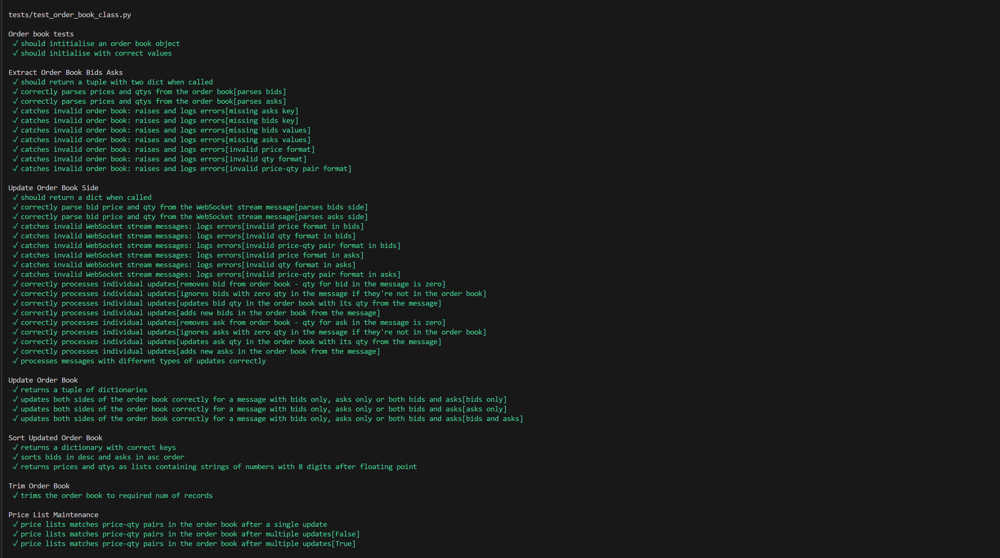

# 📈 Local Order Book – Binance WebSockets Stream

## 🔰 Overview
An asynchronous Python project that creates and maintains a **local copy of Binance’s order book** in real time using WebSocket depth update streams.  
It verifies the consistency of the local order book by synchronizing with Binance REST API snapshots and performing checksum validations.

## 🔧 Tech Stack
**Language**  
- Python 3.13

**Core Libraries**  
- `asyncio` – event loop for concurrency  
- `websockets` – connection to Binance WebSocket streams  
- `aiohttp` – asynchronous REST API requests (order book snapshots)  
- `bisect` – maintaining sorted price lists efficiently  
- `logging` – event and error tracking  
- `pytest` – unit testing of order book logic  

**Design & Architecture**  
- Object-Oriented Design with an `OrderBook` class  
- Asynchronous ingestion, synchronization, and processing pipelines  
- Modular file structure with separation of concerns  

## 📊 How It Works
1. **Subscribe** to Binance WebSocket depth update streams  
2. **Ingest** depth updates into a local buffer  
3. **Sync** the buffer with a REST API snapshot to ensure consistency  
4. **Process** updates to maintain a local order book object  
   - Dictionary of prices/quantities for bids and asks  
   - Lists of best bid/ask prices for fast access  
5. **Validate** the local order book by running checksum checks *(in progress)*  

## 🚀 Project Milestones (Work in Progress)

- ✅ Connect to Binance WebSockets  
- ✅ Ingest WebSocket depth update messages into a local buffer  
- ✅ Get a snapshot of the order book from Binance REST API  
- ✅ Synchronize WebSocket updates with the snapshot  
- ✅ Define the `OrderBook` class  
- ✅ Implement processing logic for order book updates  
   - Dictionary of asks/bids with prices and quantities  
   - Lists of best bid/ask prices  
- ✅ Test processing logic thoroughly  
- 🚧 Integrate all components into a single async event loop  
- ⏳ Test the async event loop  
- ⏳ Implement checksum validation  
- ⏳ Replace print statements with structured logging  
- ⏳ Implement buffer size monitoring  
- ⏳ Add client-facing order book snapshot requests  
- ⏳ Design data flows for saving snapshots and automated validations  
- ⏳ Ensure clean Pythonic project structure  

---

## ▶️ Usage Instructions
Run the main event loop:
```bash
python main.py
```


## 🖥️ Demo Output - tests



## 📁 File Structure
Run the main event loop:
```
local_order_book/
│
├── main.py                        # Entry point
│
├── src/
│   ├── wb_sockets/               # WebSockets related code
│   │   ├── subscribing.py        # subscribing to the WebSockets stream
│   │   ├── ingesting.py          # ws_ingestion logic (save depth update messages to the local buffer)
│   │   ├── syncing.py            # match the depth update messages to the order book snapshot 
│   │   └── processing.py         # ws_processing logic (apply updates to OrderBook)
│   │
│   ├── order_book/               # Order book domain logic
│   │    └── order_book_class.py  # OrderBook class and update methods
│   │
│   └── utils/                    # Reusable helpers
│      ├── logger.py              # logging setup
│      └── helpers.py             # miscellaneous utilities (path finder at this stage)
│
├── tests/                        # Unit tests
│    └── test_order_book.py       # core processing logic test
│
├── .gitignore
├── requirements.txt
└── README.md
```

